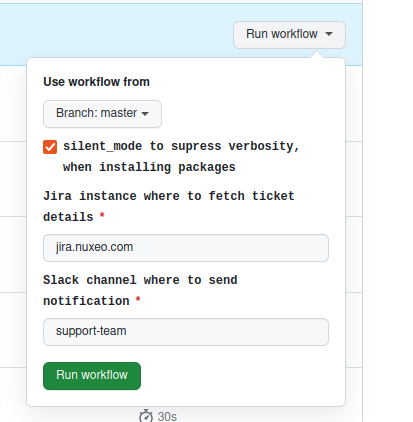
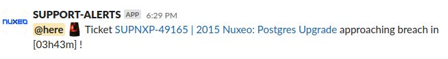

## GitHub Workflows
- [BreachWatcher.yml](#BreachWatcheryml)
- [BreachWatcher247.yml](#BreachWatcheryml)
## GitHub Actions
### BreachWatcher.yml

This workflow is intended to dispatch notifications to a Slack channel for tickets that are nearing a breach status.

```yaml
on:
  workflow_dispatch:
    inputs:
      silent_mode:
        description: silent_mode to supress verbosity, when installing packages
        type: boolean
        default: true
        required: true
      jira_host:
        description: Jira instance where to fetch ticket details
        default: jira.nuxeo.com
        required: true
      slack_channel:
        description: Slack channel where to send notification
        default: support-team
        required: true
```
This will allow workflow to be triggered manually using Github Actions UI. This section specifies the set of input parameters that can be provided/changed when manually triggering the workflow. Slack channel name/id, jira host url can be changed when running this workflow manually.
To trigger workflow manually
Navigate to "Actions" tab at the top of the repository.In the left sidebar,click on the BreachWatcher Workflow. Click on "Run workflow" button towards the top right corner of the page. Input parameter can be modified while running this workflow.


```yml
  schedule:
    # Everyday at every hour.
    - cron: '20 0-23/1 * * *'
```
This will allow workflow to trigger at specific intervals. For now this cron is running at every 20th minute of every hour(0-23) in a day.

```yml
env:
  SILENT_MODE: ${{ github.event.inputs.silent_mode || true }}
  JIRA_HOST: ${{ github.event.inputs.jira_host || 'jira.nuxeo.com' }}
  SLACK_CHANNEL: ${{ github.event.inputs.slack_channel || 'support-team' }}
  JIRA_USERNAME: ${{ secrets.JIRA_USERNAME }}
  JIRA_PASSWORD: ${{ secrets.JIRA_PASSWORD }}
```
Environment variables which can be accessible in the subsequent steps. Jira Username and password values are stored in the GitHub repository secrets under key JIRA_USERNAME and JIRA_PASSWORD respectively. These value can be updated by updating keys under repository secrets.

```yml
jobs:
```
Contains 3 user-define jobs. 
```yml
  prepare-matrix:
    runs-on: ubuntu-latest
    outputs:
      matrix: ${{ steps.create-ticket-matrix.outputs.matrix }}
      ticketResultsLength: ${{ steps.create-ticket-matrix.outputs.ticketResultsLength }}
```
This job will check for the tickets which are about to breach in 4 hours. It consists of following sequence of tasks.
```yml
    steps:
      - name: Checkout Repository
        uses: actions/checkout@b4ffde65f46336ab88eb53be808477a3936bae11 # v4.1.1
```
This action checks-out your repository under $GITHUB_WORKSPACE, so your workflow can access it. Set fetch-depth: 0 to fetch all history for all branches and tags.

```yml
      - name: Set up Python
        uses: actions/setup-python@0a5c61591373683505ea898e09a3ea4f39ef2b9c # v5.0.0
        with:
          python-version: 3.x
```
This action install python 3.x version and caching dependencies for pip, pipenv
```yml
      - name: Create Ticket Matrix
        id: create-ticket-matrix
        run: |
          ticketsResults=$( ./execute_stage.sh tickets_at_risk )
          echo "ticketResultsLength=${#ticketsResults}" >> $GITHUB_OUTPUT
          if [ -n "$ticketsResults" ];then
            matrix=$( echo "$ticketsResults"|jq -R 'capture("(?<targets>@here) :(?<alert>.*?): <(?<url>[^ ]+)> (?<title>.*) :[^w]+ (?<duration>.*)")' | jq -sc )
            echo "matrix=$matrix" >> $GITHUB_OUTPUT
          fi
        working-directory: ./tickets/stages/
```
This step will fetch the tickets from jira which are approaching breach status by executing a shell script. It will further create the json object to send ticket notification one by one.
```yml
      - name: No tickets
        if: ${{ steps.create-ticket-matrix.outputs.ticketResultsLength == 0  }}
        run: echo "No tickets are approaching breach"
```
In this step if there are no tickets returned by the script then it will print message as "No tickets are approaching breach" and the workflow exits.
```yml
  notification:
    needs: prepare-matrix
    runs-on: ubuntu-latest
    if: ${{ needs.prepare-matrix.outputs.ticketResultsLength != 0 }}
    strategy:
      matrix:
        tickets: ${{ fromJson(needs.prepare-matrix.outputs.matrix) }}
    steps:
      - name: Sending Tickets at Risk Notifications
        uses: slackapi/slack-github-action@e28cf165c92ffef168d23c5c9000cffc8a25e117 # v1.24.0
        env:
          SLACK_BOT_TOKEN: ${{ secrets.SLACK_TOKEN }}
        with:
          channel-id: "${{ env.SLACK_CHANNEL }}"
          payload: |
            {
              "text": "Notification on <${{ matrix.tickets.url }}|${{ matrix.tickets.title }}> breach status",
              "blocks": [
                {
                  "type": "section",
                  "text": {
                    "type": "mrkdwn",
                    "text": "${{ matrix.tickets.targets }} :${{ matrix.tickets.alert }}: Ticket <${{ matrix.tickets.url }} | ${{ matrix.tickets.title }}> approaching breach in ${{ matrix.tickets.duration }} !"
                  }
                }
              ]
            }
```
It depends on successful completion of "prepare-matrix" and uses a matrix strategy for parallel execution based on values obtained from output of "prepare-matrix" job. After matrix preparation, slack-github-action send notification to a slack channel. The value of SLACK_BOT_TOKEN is stored as a secret in github repository.
Slack Notification is generated like below:

```yml
 notify-on-error:
    runs-on: ubuntu-latest
    needs: [prepare-matrix]
    if: ${{ failure() }}
    steps:
      - name: Slack Notification
        uses: slackapi/slack-github-action@e28cf165c92ffef168d23c5c9000cffc8a25e117
        with:
          channel-id: "support-team-notifs"
          slack-message: "Breatchwatcher job failed! <${{ github.server_url }}/${{ github.repository }}/actions/runs/${{ github.run_id }}|Click here>"
        env:
          SLACK_BOT_TOKEN: ${{ secrets.SLACK_TOKEN }}
```
This job sends a Slack notification to the "support-team-notifs" channel if the preceding job "prepare-matrix" fails. The notification includes a message about the failure and a link to the corresponding GitHub Actions run for more information.
Slack notification generated like below:


